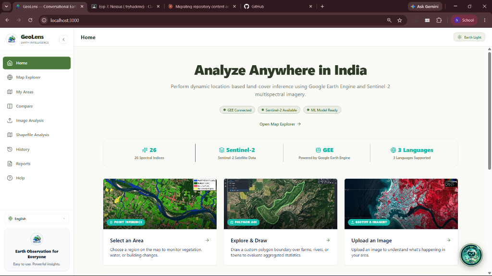
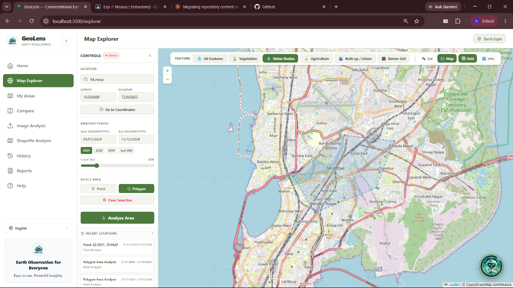

<div align="center">

# 🌍 GeoLens — Earth Intelligence & Conversational Analytics Platform

[](https://nextjs.org/)
[](https://www.python.org/)
[](https://flask.palletsprojects.com/)
[](https://earthengine.google.com/)
[](https://groq.com/)
[](LICENSE)

<br/>

**GeoLens** is an advanced Earth Observation (EO) and Geospatial AI platform built to analyze satellite imagery, monitor land-use change, and provide natural language conversational insights anywhere across India. Powered by **Google Earth Engine (Sentinel-2)**, **ExtraTrees ML Classifiers**, and **Orbit — the Earth Intelligence AI Assistant**, GeoLens translates complex remote sensing data into actionable insights.

</div>

---

<h2 align="center">📸 Platform Highlights</h2>

<p align="center">
  
  
</p>

<p align="center">
  <i>Left: <b>Home Dashboard & System Overview</b> &nbsp;•&nbsp; Right: <b>Interactive Map Explorer & AOI Analytics</b></i>
</p>

---

## ✨ Key Features

- **🛰️ Sentinel-2 Multispectral Analytics:**
  Calculates 26+ spectral indices including **NDVI** (Normalized Difference Vegetation Index), **NDWI** (Water Index), **NDBI** (Built-up Index), **MNDWI**, **BSI** (Bare Soil Index), and **SAVI**.

- **🤖 Orbit AI Assistant (Earth Intelligence LLM):**
  A contextual chatbot powered by Groq LLMs. Orbit dynamically reads active screen reports across Map Explorer, Period Comparison, Image Analysis, and Shapefile Analysis without numerical hallucinations.

- **🔄 Temporal Land-Cover Comparison:**
  Side-by-side Period 1 vs Period 2 change detection to track deforestation, urban expansion, water body shrinkage, and agricultural trends.

- **🖼️ GeoTIFF & Image Analysis:**
  Upload custom GeoTIFF multi-spectral rasters or imagery to execute local ExtraTrees classification and band inspection.

- **📁 Shapefile Vector Analytics:**
  Upload ZIP shapefiles to evaluate area metrics, polygon boundaries, and per-feature land cover transitions.

- **🌐 Multi-Lingual Interface:**
  Supports **English**, **Hindi (हिन्दी)**, and **Marathi (मराठी)** across UI controls and Orbit AI conversations.

---

## 🏗️ System Architecture

```text
┌─────────────────────────────────────────────────────────────────┐
│                    Next.js 14 Web Frontend                      │
│   (TypeScript, Tailwind CSS, Leaflet GIS, Context Provider)     │
└───────────────────────────────┬─────────────────────────────────┘
                                │ REST API / JSON
┌───────────────────────────────▼─────────────────────────────────┐
│                    Python Flask Backend Engine                  │
│                     (Port 5000 / REST API)                      │
├────────────────────────────────┬────────────────────────────────┤
│   Google Earth Engine (GEE)    │   ExtraTrees ML Classifier     │
│   Sentinel-2 Multispectral     │   6,000 Sample Ground Truth    │
├────────────────────────────────┴────────────────────────────────┤
│             Orbit AI Layer (Groq LLM Synthesis)                 │
│      Dynamic Single Source of Truth Prompting Engine            │
└─────────────────────────────────────────────────────────────────┘
```

---

## 🚀 Getting Started

### Prerequisites
- **Node.js**: v18.0.0 or higher
- **Python**: v3.10 or higher
- **Groq API Key**: (Sign up at [console.groq.com](https://console.groq.com))

---

### 1. Backend Setup

```bash
# Navigate to backend directory
cd backend

# Create virtual environment (optional but recommended)
python -m venv venv
source venv/bin/activate  # On Windows: venv\Scripts\activate

# Install dependencies
pip install -r requirements.txt

# Create .env file with your API keys
cp .env.example .env
```

Ensure your `.env` contains:
```env
GROQ_API_KEY=your_groq_api_key_here
GEE_PROJECT_ID=your_gee_project_id_here
PORT=5000
```

Start backend service:
```bash
python app.py
```
*Backend runs on `http://localhost:5000`*

---

### 2. Frontend Setup

```bash
# Navigate to frontend directory
cd frontend

# Install dependencies
npm install

# Start Next.js development server
npm run dev
```
*Frontend runs on `http://localhost:3000`*

---

## 🛠️ API Reference

| Endpoint | Method | Description |
| :--- | :--- | :--- |
| `/api/health/gee` | `GET` | Verifies Google Earth Engine connectivity |
| `/api/predict/location` | `POST` | Fetches Sentinel-2 imagery & runs ML classification |
| `/api/reason` | `POST` | Generates Orbit AI contextual reasoning for queries |
| `/api/compare` | `POST` | Calculates Period 1 vs Period 2 change detection |
| `/api/analyze-image` | `POST` | Processes uploaded GeoTIFF / imagery rasters |
| `/api/shapefile/analyze` | `POST` | Processes uploaded ZIP vector shapefiles |

---

## 🤝 Contributing

Contributions are welcome! Please feel free to open issues or submit pull requests.

1. Fork the Project
2. Create your Feature Branch (`git checkout -b feature/AmazingFeature`)
3. Commit your Changes (`git commit -m 'Add some AmazingFeature'`)
4. Push to the Branch (`git push origin feature/AmazingFeature`)
5. Open a Pull Request

---

## 📄 License

Distributed under the MIT License. See `LICENSE` for details.
